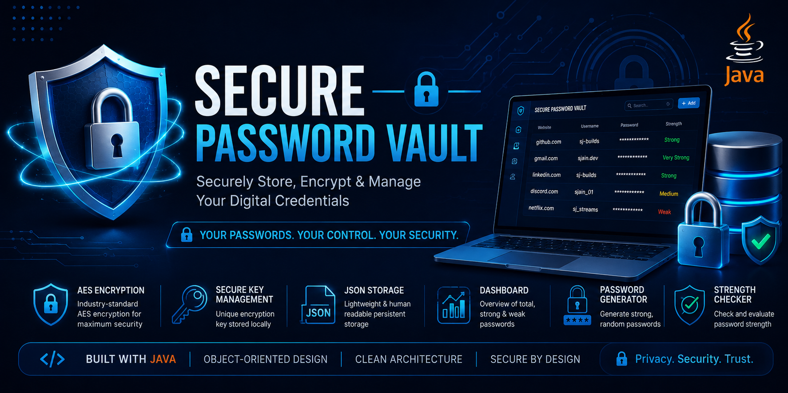
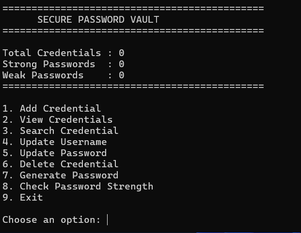
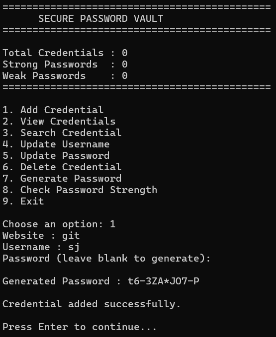
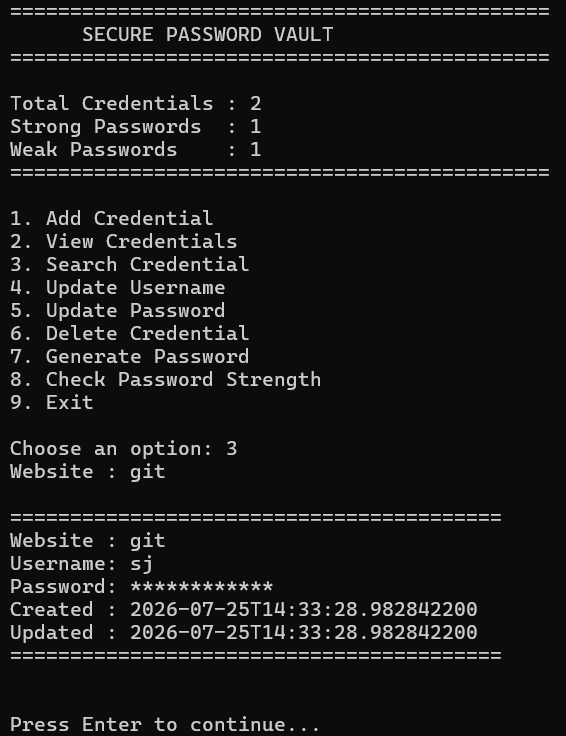
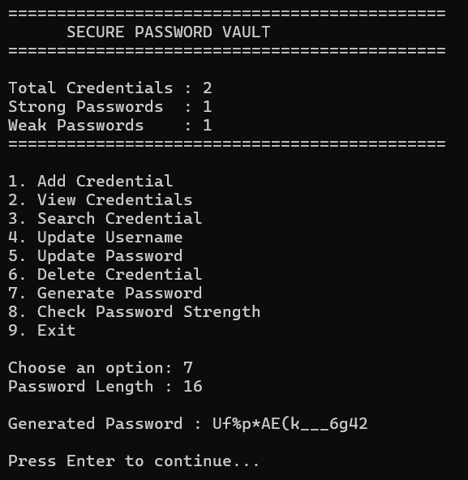

<p align="center">
  
</p>

<h1 align="center">🔐 Secure Password Vault</h1>

<p align="center">
A secure, lightweight password manager built in <strong>Java</strong> that encrypts credentials before storing them locally using <strong>AES encryption</strong> and <strong>JSON persistence</strong>.
</p>

<p align="center">


</p>

<p align="center">
  
</p>

<p align="center">

📄 <a href=".github/assets/presentation/Secure%20Password%20Vault.pdf">Presentation</a>
•
⭐ <a href="https://github.com/sj-builds/secure-password-vault-java">Repository</a>
•
📜 <a href="LICENSE">License</a>

</p>

---

## ✨ Overview

Secure Password Vault is a console-based password manager developed in Java to demonstrate secure software engineering practices. The application encrypts passwords before storing them locally, helping users manage credentials safely while showcasing object-oriented programming, modular architecture, and file handling.

---

## 🚀 Features

- 🔐 AES Encryption
- 🔑 Secure Password Generator
- 💪 Password Strength Analyzer
- 🔍 Search Credentials
- ✏️ Update Username & Password
- 🗑 Delete Credentials
- 💾 Encrypted JSON Storage
- 📊 Dashboard Statistics
- 🏗 Modular Architecture

---

## 📸 Application Preview

| Dashboard | Add Credential |
|-----------|----------------|
|  |  |

| Search Credential | Password Generator |
|-------------------|--------------------|
|  |  |

---

## 🛠 Tech Stack

| Category | Technology |
|----------|------------|
| Language | Java |
| Security | AES Encryption |
| Storage | JSON |
| Libraries | Jackson |
| IDE | VS Code |
| Version Control | Git & GitHub |

---

## 📂 Project Structure

```text
src/
├── model/
├── security/
├── service/
├── storage/
└── ui/

data/
lib/
.github/
README.md
```

---

## 🔒 Security Highlights

- Encrypts passwords before storage
- Secure password generation using `SecureRandom`
- Password strength evaluation
- Local encrypted JSON persistence
- Modular and maintainable architecture

---

## 🚀 Getting Started

Clone the repository

```bash
git clone https://github.com/sj-builds/secure-password-vault-java.git
cd secure-password-vault-java
```

Compile

```bash
javac -cp "lib/*" -d out src/**/*.java
```

Run

```bash
java -cp "out;lib/*" ui.PasswordVault
```

---

## 🔮 Roadmap

- JavaFX Desktop Interface
- Master Password Authentication
- AES-GCM Encryption
- Database Integration
- Cross-platform Installer

---

## 📊 Repository Stats

- **Language:** Java
- **Architecture:** Layered / Modular
- **Storage:** JSON
- **Encryption:** AES
- **Project Type:** Console Application

---

## 👨‍💻 Author

**Shreyansh Jain**

Software Engineering • AI • Cybersecurity

- GitHub: https://github.com/sj-builds
- LinkedIn: https://linkedin.com/in/shreyanshjain-tech

---

<p align="center">

⭐ If you like this project, consider giving it a star!

</p>