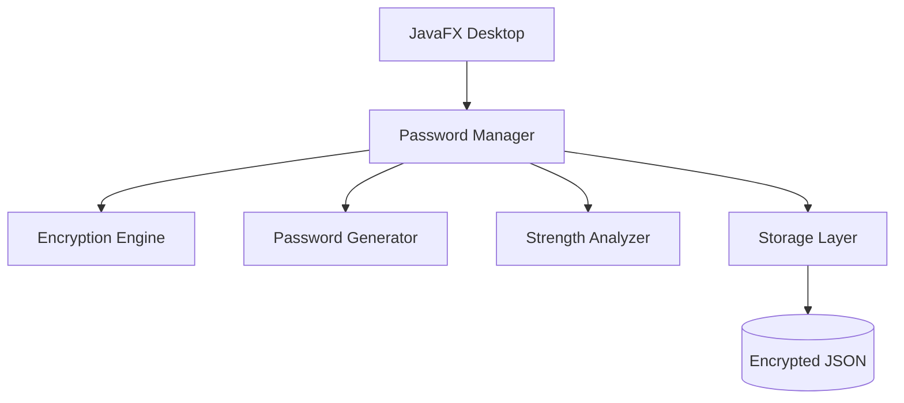

<p align="center">
  
</p>

<h1 align="center">🔐 Secure Password Vault</h1>

<p align="center">
A modern <strong>Java & JavaFX</strong> desktop password manager built with
<strong>AES encryption</strong>, <strong>clean architecture</strong>, and
<strong>security-first design</strong>.
</p>

<p align="center">


</p>

<p align="center">

</p>

---

## ✨ Overview

**Secure Password Vault** is a lightweight desktop application that securely stores and manages passwords using **AES encryption**. Built with **Java** and **JavaFX**, the project demonstrates modern software engineering practices including layered architecture, object-oriented design, modular development, and secure credential management.

This project was created to showcase practical Java development beyond traditional CRUD applications.

---

## 🚀 Features

| Feature | Description |
|---------|-------------|
| 🔐 AES Encryption | Passwords are encrypted before storage |
| 🔑 Password Generator | Generates secure passwords using `SecureRandom` |
| 💪 Strength Analyzer | Evaluates password complexity |
| 📊 Dashboard | View password statistics and security overview |
| 🔎 Search | Quickly find stored credentials |
| 📋 Clipboard Support | Copy usernames and passwords |
| 👁 Password Visibility | Reveal or hide passwords securely |
| 💾 Local Storage | Encrypted JSON persistence |
| 🏗 Clean Architecture | Modular and maintainable codebase |

---

## 📸 Application Preview

### Login


### Dashboard


### Credential Manager


### Password Generator


---

## 🏛 Architecture



---

## 📂 Project Structure

```text
SecurePasswordVault
│
├── src
│   ├── model
│   ├── security
│   ├── service
│   ├── storage
│   └── ui
│
├── data
├── lib
├── .github
└── README.md
```

---

## 🔒 Security

- AES encrypted password storage
- SecureRandom password generation
- Password masking
- Local key management
- Encrypted JSON persistence
- Security-first application design

---

## ⚙ Tech Stack

| Category | Technology |
|----------|------------|
| Language | Java 17 |
| UI | JavaFX |
| Security | AES |
| Storage | JSON |
| Library | Jackson |
| IDE | IntelliJ IDEA / VS Code |
| Version Control | Git & GitHub |

---

## 🚀 Getting Started

Clone the repository

```bash
git clone https://github.com/sj-builds/secure-password-vault-java.git
cd secure-password-vault-java
```

Compile

```bash
javac -cp "lib/*" -d out src/**/*.java
```

Run

### Windows

```bash
java -cp "out;lib/*" ui.PasswordVault
```

### Linux / macOS

```bash
java -cp "out:lib/*" ui.PasswordVault
```

---

## 🎯 What This Project Demonstrates

- Object-Oriented Programming
- Clean Architecture
- JavaFX Desktop Development
- AES Encryption
- Secure Credential Management
- File Handling
- JSON Serialization
- Exception Handling
- Modular Design
- Software Engineering Best Practices

---

## 🤝 Contributing

Contributions, suggestions, and bug reports are always welcome.

If you'd like to improve the project:

1. Fork the repository
2. Create a new branch
3. Commit your changes
4. Open a Pull Request

---

## 📄 License

This project is licensed under the **MIT License**.

See the [LICENSE](LICENSE) file for more information.

---

## 👨‍💻 Author

### Shreyansh Jain

**BCA Student • Software Engineer • AI • Cybersecurity**

<p>

<a href="https://github.com/sj-builds">

</a>

<a href="https://linkedin.com/in/shreyanshjain-tech">

</a>

</p>

---

<p align="center">

### ⭐ If you found this project helpful, consider giving it a star!

**Built with ❤️ using Java, JavaFX, and secure software engineering principles.**

</p>